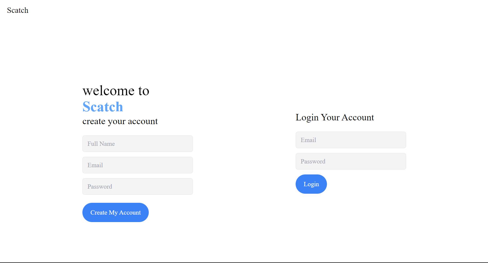
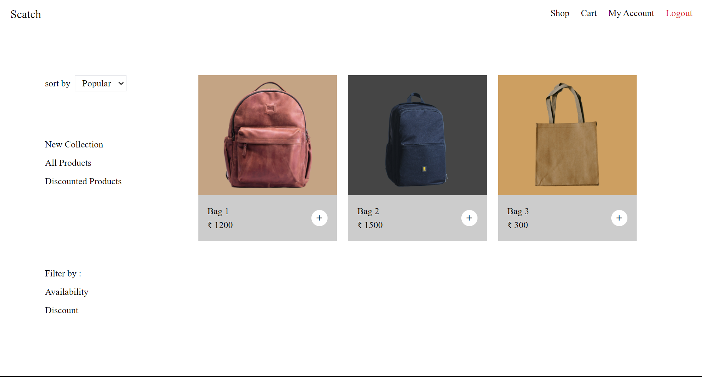
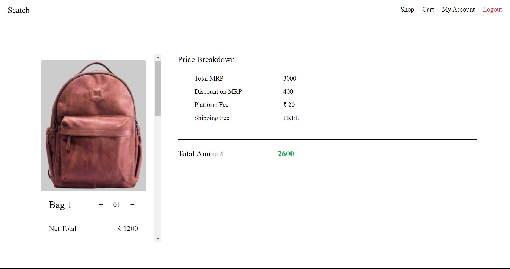
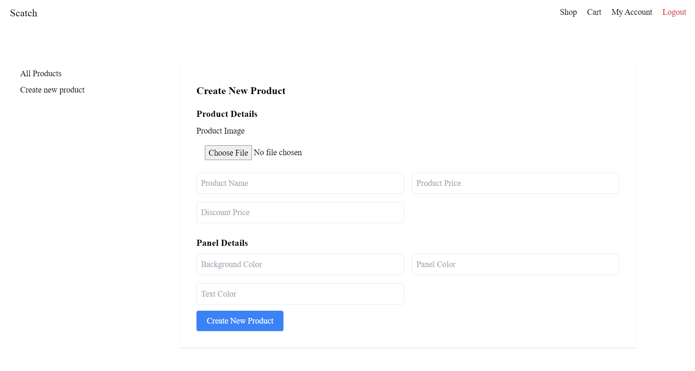

# Scatch

Scatch is an online platform designed for selling bags. It allows users to browse a variety of products, add them to their cart, and manage their orders seamlessly. The application is built with Node.js, Express, and MongoDB, and features a user-friendly interface to enhance the shopping experience.

## Features

- **User Registration and Login:** Users can create accounts and log in to access their shopping cart.
- **Product Management:** Owners can add, edit, and manage products using a dedicated admin interface.
- **Shopping Cart:** Users can add products to their cart and view their selected items.
- **Dynamic Product Display:** Products are dynamically loaded from the database for easy management.
- **Discounts and Pricing:** The application supports pricing and discount functionalities for each product.
- **Secure Authentication:** Utilizes JWT for secure user authentication.

## Technologies Used

- **Backend:** Node.js, Express.js
- **Database:** MongoDB
- **Authentication:** JWT (JSON Web Tokens)
- **File Upload:** Multer for handling image uploads
- **Flash Messages:** Connect-flash for user notifications

## Installation

1. Clone the repository:
   ```bash
   git clone https://github.com/yourusername/scatch.git
   cd scatch
   ```

2. Install dependencies:
   ```bash
   npm install
   ```

3. Set up your environment variables in a `.env` file:
   ```bash
   JWT_KEY=your_jwt_secret_key
   ```

4. Start the MongoDB server:
   ```bash
   mongod
   ```

5. Run the application:
   ```bash
   node app.js
   ```

## Usage

1. Open your browser and navigate to `http://localhost:3000`.
2. Register a new account or log in if you already have one.
3. Browse through the products and add them to your cart.
4. Access the cart to view or remove items before checkout.

## Screenshots

### Home Page


### Product Page


### Cart Page


### Admin Page


## Contributing

Contributions are welcome! Please open an issue or submit a pull request for any improvements or bug fixes.

## License

This project is licensed under the MIT License. See the [LICENSE](LICENSE) file for more details.

## Acknowledgments

- [Express](https://expressjs.com/) for the web framework
- [Mongoose](https://mongoosejs.com/) for MongoDB object modeling
- [JWT](https://jwt.io/) for authentication
- [Multer](https://www.npmjs.com/package/multer) for handling file uploads
- [Sheryians Coding School](https://youtube.com/playlist?list=PLbtI3_MArDOkXRLxdMt1NOMtCS-84ibHH&si=sZsHNWBiOzpyy24s) for guidance on building the project


```